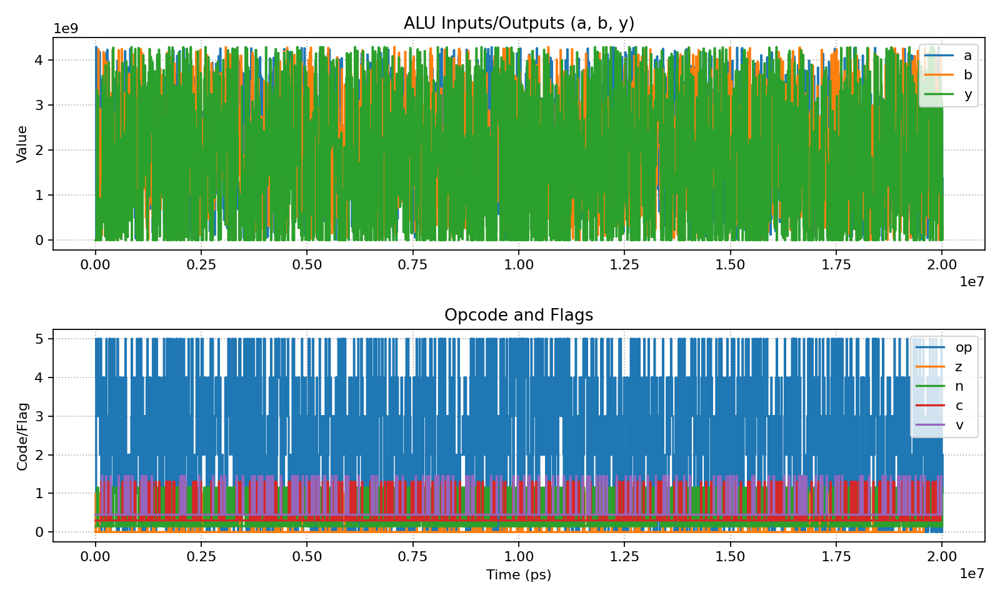

# ALU Verification Project (Verilog/SystemVerilog/VHDL/UVM)

## Objective
Design a **32-bit ALU** (RTL in Verilog + VHDL) and verify it using a **SystemVerilog UVM-style testbench** with directed and random tests, assertions, functional coverage, and automation infrastructure.  
This project demonstrates **digital design and verification workflows** used in CPU/GPU and SoC development.

## Features
- **RTL Design**
  - 32-bit ALU (ADD, SUB, AND, OR, XOR, SLT)
  - Status flags: Zero (Z), Negative (N), Carry (C), Overflow (V)
  - Implemented in both **Verilog** and **VHDL**
- **Verification Environment**
  - SystemVerilog **UVM-lite** testbench
  - Directed + random functional tests
  - Assertions to check design invariants (e.g., SLT outputs only {0,1})
  - Functional coverage on operations and flags
- **Automation & Infrastructure**
  - `Makefile` for build/run/clean targets
  - **Perl** script for parsing simulation logs (PASS/FAIL summary)
  - **TCL** wave configuration for GTKWave/Verdi
  - Works on **Linux/macOS** with open-source tools (Icarus Verilog + GTKWave)

## Tools & Technologies
- **Languages**: Verilog, SystemVerilog, VHDL, UVM-lite, Perl, TCL, Make
- **Simulation**: Icarus Verilog (`iverilog`), VVP runtime
- **Waveforms**: GTKWave (open-source), Verdi (optional)
- **OS/Infra**: Linux/macOS shell, Git/GitHub

## Usage & Results
```bash
# Clone repo
git clone https://github.com/tkim683/alu-verification-uvm.git
cd alu-verification-uvm

# Run simulation
make sim

# View waveforms (optional)
make waves

```
## Simulation Output
- COVER: OP0_ADD hits=350
- COVER: OP1_SUB hits=325
- COVER: OP2_AND hits=343
- COVER: OP3_OR  hits=342
- COVER: OP4_XOR hits=324
- COVER: OP5_SLT hits=319
- SUMMARY: PASS=1 FAIL=0

## Waveform Visualization

Below is the waveform generated from the **ALU simulation (build/alu.vcd)** using the Python visualization script.




